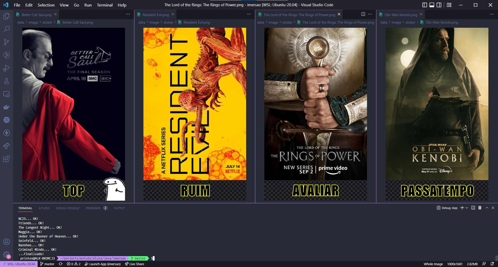
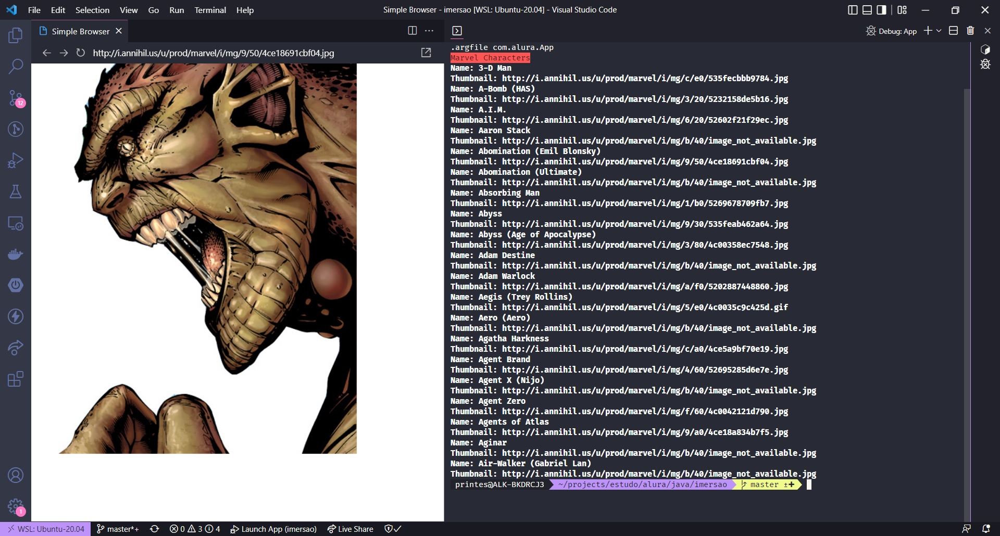
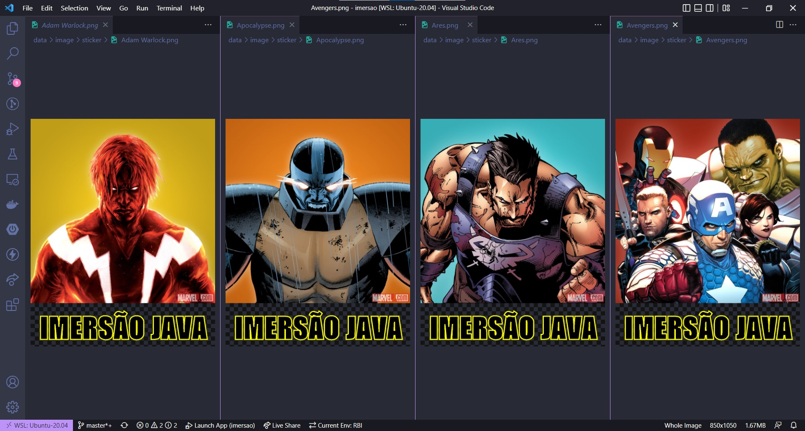

<p align="center">
  <a href="" rel="noopener">
 </a>
</p>

<h3 align="center">PROJETO DE IMERSÃO EM JAVA</h3>

<div align="center">

[]()

</div>

---

<p align="center"> Projeto iniciado na imersão, com o intuito de conhecer outras ferramentas, bibliotecas e técnicas para aprimorar o meu conhecimento no desenvolvimento WEB com Java.
<br> 
</p>


## 📝 Sumário

- [Sobre](#sobre)
- [Começando](#comecando)
- [Execução](#execucao)
- [Saída](#saida)
- [Desenvolvimento](#desenvolvimento)
- [Ferramentas](#ferramentas)
- [Colaboradores](#colaboradores)
- [Agradecimento](#agradecimento)


## 🧐 Sobre <a name = "sobre"></a>

Código a ser desenvolvido ao longo dessa imersão, aplicando o meu conhecimento em Java.


## 🏁 Começando <a name = "comecando"></a>

Necessário conhecimento básico da linguagem Java. Faz uso da JDK 11, podendo ser alterado para qualquer versão, mas atenção, nesse cenário haverá alta possibilidade de quebra, corrija os erros na refatoração. Veja a seção de [Desenvolvimento](#desenvolvimento) para saber o que vem por aí.

### Pre-requisitos

Verifique a versão do Java, que está instalado na sua máquina com o seguinte comando:

```
java --version
```

### Instalação

Caso não tenha instalado, ou precise atualizar para uma versão mais recente, existe muitos tutoriais na internet que ajudam a fazer isso, de acordo com seu sistema operacional. Caso tenha dificuldade, só enviar um email, ou mensagem no Discord, que tentarei ajudar.


## 🚀 Execução <a name = "execucao"></a>

Faça os seguintes passos:

### Compilando e empacotando o projeto para gerar o arquivo _JAR_ :

```
mvn clean package
```

### E adicionando os parâmetros (<strong>Keys</strong>), para autenticação, nas requisições das APIs:

```
 java -Dimdb_key=${IMDB_KEY} -Dmarvel_public_key=${MARVEL_PUBLIC_KEY} -Dmarvel_private_key=${MARVEL_PRIVATE_KEY}
 -jar target/imersao-1.0-SNAPSHOT-jar-with-dependencies.jar
```

## 🎈 Saída <a name="saida"></a>

Exemplos da saída atual:








## 🔧 Desenvolvimento <a name = "desenvolvimento"></a>

Conteúdo a partir da Aula 03 e refatorações:
- [x] Reestruturação do projeto para consumir a Api da MARVEL.
- [x] Sobrescrita do método de saída no terminal com informacões da nova Api;
- [x] Sobrescrita do método de geração de Stickers para imagens da nova Api;
- [x] Uso de uma classe de exceção personalizado;
- [x] Automatizar a criação da instância da interface <strong>StickerApi</strong> de acordo com o _endpoint_ a ser consumido;
- [x] Upgrade da JDK do projeto, versao 17, para implementar casos de uso com classes <strong>Record</strong>;
- [x] Uso de uma classe abstrata, para separar os metodos relacionados aos dados do consumo das Apis;
- [ ] Adição de campo imagem em um modelo utilizado em uma terceira Api, desenvolvida em um Challange de Back-end na Alura, para ser utilizada como um microserviço: [Spring Boot API](https://github.com/durvalprintes/alura-challenge-spring-api)
- [ ] Criacao da classe de implementacao para consumo desta última;


## ⛏️ Ferramentas <a name = "ferramentas"></a>

- [Java](https://www.oracle.com/java/technologies/downloads/#java11) - Java JDK
- [Maven](https://maven.apache.org/download.cgi) - Apache Maven Project


## ✍️ Colaboradores <a name = "colaboradores"></a>

- [@durvalprintes](https://github.com/durvalprintes/) - Trabalho inicial


## 🎉 Agradecimento <a name = "agradecimento"></a>

- A todos que participam e ajudaram a tirar do papel essa imersão
