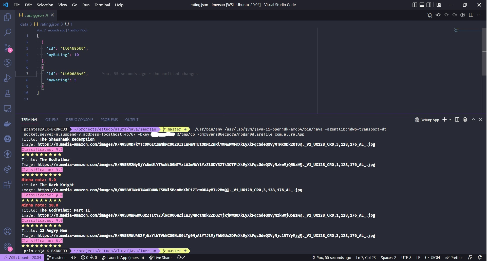

<p align="center">
  <a href="" rel="noopener">
 </a>
</p>

<h3 align="center">Projeto de Imersão em Java</h3>

---

<p align="center"> Projeto iniciado na imersão, com o intuito de conhecer outras ferramentas, bibliotecas e técnicas para aprimorar o meu conhecimento no desenvolvimento WEB com Java.
<br> 
</p>


## 📝 Sumário

- [Sobre](#sobre)
- [Começando](#comecando)
- [Execução](#execucao)
- [Saída](#saida)
- [Desenvolvimento](#desenvolvimento)
- [Ferramentas](#ferramentas)
- [Colaboradores](#colaboradores)
- [Agradecimento](#agradecimento)


## 🧐 Sobre <a name = "sobre"></a>

Código a ser desenvolvido ao longo dessa imersão, aplicando o meu conhecimento em Java.


## 🏁 Começando <a name = "comecando"></a>

Necessário conhecimento básico da liguagem Java. Faz uso da JDK 11, podendo ser alterado para qualquer versão, mas atenção, nesse cenário haverá alta possibilidade de quebra, corrija os erros na refatoração. Veja a seção de [Desenvolvimento](#desenvolvimento) para saber o que vem por aí.

### Pre-requisitos

Verifique a versão do Java, que está instalado na sua máquina com o seguinte comando:

```
java --version
```

### Instalação

Caso não tenha instalado, ou precise atualizar para uma versão mais recente, existe muitos tutoriais na internet que ajudam a fazer isso, de acordo com seu sistema operacional. Caso tenha dificuldade, só enviar um email, ou mensagem no Discord, que tentarei ajudar.


## 🔧 Execução <a name = "execucao"></a>

Faça os seguintes passos:

### Compilando e empacotando o projeto para gerar o arquivo _JAR_ :

```
mvn clean package
```

### E adicionando o parâmetro <strong>Key</strong> e o seu valor, para as requisições da API:

```
java -Dkey={$IMDB_API_KEY} -jar target/imersao-1.0-SNAPSHOT-jar-with-dependencies.jar
```


## 🎈 Saída <a name="saida"></a>

Exemplos da saída atual:




## 🚀 Desenvolvimento <a name = "desenvolvimento"></a>

Será adicionado como desafio, um arquivo .txt, contendo valores a serem utilizados em um campo específico no objeto de retorno do JSON.


## ⛏️ Ferramentas <a name = "ferramentas"></a>

- [Java](https://www.oracle.com/java/technologies/downloads/#java11) - Java JDK
- [Maven](https://maven.apache.org/download.cgi) - Apache Maven Project


## ✍️ Colaboradores <a name = "colaboradores"></a>

- [@durvalprintes](https://github.com/durvalprintes/) - Trabalho inicial


## 🎉 Agradecimento <a name = "agradecimento"></a>

- A todos que participam e ajudaram a tirar do papel essa imersão
